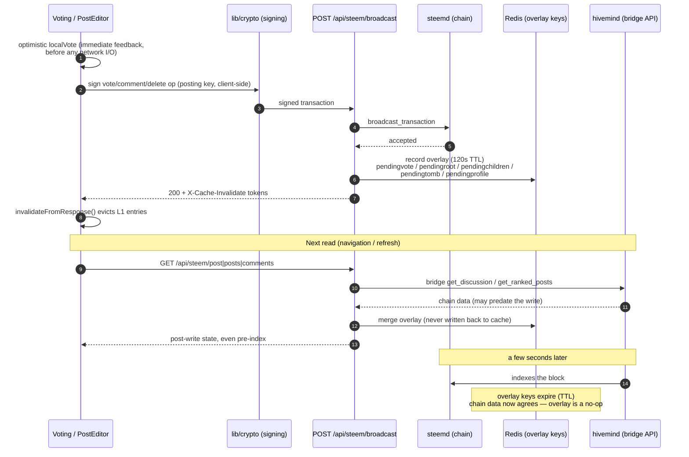
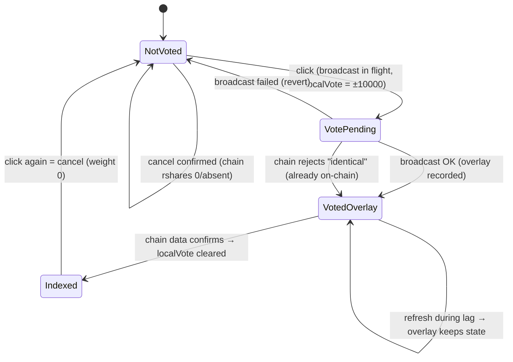
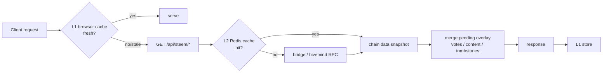

# Vote State & Write Convergence

How a user's write (vote, post, reply, edit, delete, profile save) becomes
visible again on read, despite the hivemind indexing lag. This documents the
closed loop implemented in PR #4026 (`fix/vote-state-feedback`) and its
profile-save extension.

## The problem

Writes and reads take different paths on the Steem stack:

- **Writes** go to **steemd** (`condenser_api.broadcast_transaction`) and are
  effective within one block (~3s).
- **Reads** go through the **bridge API**, backed by **hivemind**, which indexes
  blocks with a few seconds of lag (occasionally more).

Within that window, a page refresh serves pre-write state: a just-cast vote
disappears, a just-published post 404s. Two cache layers (browser L1, Redis L2)
can extend the window by serving — or re-caching — pre-write data.

## The closed loop, at a glance

## Vote lifecycle state machine

The vote button's state as seen by one user, combining the component-local
optimistic override (`localVote` in `components/elements/Voting.tsx`), the
server overlay, and chain data:

Key rules:

- Vote direction is derived from the **sign of `active_votes[].rshares`**
  (bridge returns only `{voter, rshares}`; legacy did the same). A retained
  `rshares: "0"` entry means "canceled".
- `localVote` is component-local and **cleared as soon as chain data confirms
  the same sign** (`chainSign === Math.sign(localVote)`), and **reset whenever
  the logged-in username changes** — so cross-device changes surface and
  account switches never show a stale override.
- Overlay-synthesized votes carry `rshares: "1"` / `"-1"` (sign only; the exact
  value is unknowable pre-index). `stats.total_votes` is adjusted by the same
  delta, clamped at ≥ 0, with zero-rshares entries excluded from counting.

## Read path: merge order

1. L1 and L2 always hold **pure chain data** — the overlay is merged *after*
   the cache layers, per request, and never written back.
2. Personalized endpoints bypass L2 when an `observer` is set; the overlay
   merge applies on both paths.
3. `getDiscussion` feeds both the post route and the comments route — one
   merge point covers the post page and its whole comment tree.

## Write-side effects per operation

| Op | Overlay write (Redis, 120s TTL) | L2 (Redis) invalidation | L1 `X-Cache-Invalidate` tokens |
|---|---|---|---|
| `vote` | `steem:pendingvote:{author}:{permlink}` field voter → `{weight, ts}` (weight 0 = cancel) | `steem:posts:ranked:`, `steem:profile:{voter}`, `steem:profile:{author}` — **`steem:post:` deliberately untouched** (a delete would re-cache pre-vote data for a full TTL while hivemind lags) | `{voter}`, `permlink={permlink}` |
| `comment` (root post / edit) | `steem:pendingroot:{author}:{permlink}` → synthesized bridge-shaped post | `steem:posts:account:{author}:`, `steem:profile:{author}`, `steem:posts:ranked:` | `{author}`, `permlink={permlink}` (drops the post's own L1 entry on edits) |
| `comment` (reply) | `steem:pendingchildren:{parentAuthor}:{parentPermlink}` field `{author}/{permlink}` → post | same as above | `{author}`, `permlink={parent_permlink}` (drops the parent discussion's post+comments entries) |
| `delete_comment` | `steem:pendingtomb:{author}:{permlink}` | `steem:posts:ranked:`, `steem:profile:` | `{author}` only — the op carries no parent reference, so the parent's L1 entry goes stale within 15s and self-revalidates on the next read |
| `account_update2` | `steem:pendingprofile:{account}` → the complete new `profile` sub-object (parsed from `posting_json_metadata`) | `steem:profile:{account}` | `{account}` (drops the user's profile + account-post L1 entries) |

All Redis keys are namespaced by `redisKey()` — the actual keys carry the
`condenser:` prefix (configurable via `REDIS_KEY_PREFIX`), e.g.
`condenser:steem:pendingvote:...`. Content entries (`pendingroot`,
`pendingchildren`) store a `{ts, post}` envelope; `ts` is the broadcaster's
wall clock at broadcast time and powers the newer-than edit check below.

Tokens are sanitized to the account/permlink charset (`/^[a-z0-9.=-]+$/`)
before entering the header — op data is client-controlled and never trusted.

The L1 tokens are applied by `invalidateFromResponse()`
(`lib/cache/client-fetch.ts`), called both from `cachedFetch` (GET paths) and
from `broadcastSignedTransaction` (`lib/api/broadcast.ts`) — the broadcast POST
is a raw fetch, so the client applies the header explicitly.

## Content overlay merge semantics (`getDiscussion`)

- **New root post**: inserted when absent → the shared URL returns 200 instead
  of 404 during the indexing window.
- **Replies**: keyed by immediate parent and merged breadth-first (max 8
  levels), so nested replies appear even when their parent is itself pending.
- **Edits**: when the pending entry is newer than the chain's `last_update`
  (falling back to `created`), only the mutable fields (`title`, `body`,
  `json_metadata`) are overlaid; chain data wins otherwise.
- **Deletes**: tombstones drop the node from the discussion map; deleting a
  pending-but-unindexed root preserves the 404 contract.

## Degradation and failure modes

| Scenario | Behaviour |
|---|---|
| Redis not configured | Overlay and L2 are no-ops; everything falls back to direct RPC (pre-overlay behaviour) |
| Redis error mid-merge | Chain data served as-is |
| Broadcast fails | `localVote` reverts to the pre-attempt override; Redux reverts within the ±10000 weight domain |
| Chain: "identical to this vote" | Treated as idempotent success — the desired state is already on-chain |
| Overlay TTL expires before indexing | One refresh may show pre-write state; next read converges |
| Discussion reads with many nodes | A handful of pipelined Redis rounds: 1 root lookup + 1 per reply depth level (max 8) + 1 tombstone sweep + 1 vote merge; each round is a single RTT regardless of node count |

## Profile save overlay semantics (`getProfile`)

`account_update2` (the settings page save) changes the account row in
steemd immediately, but hivemind re-reads that row on its own schedule —
and both cache layers hold the pre-save profile. The profile overlay
(`steem:pendingprofile:{account}`, written by the broadcast route) closes
the window:

- **Merge, not synthesize**: bridge `get_profile` returns a full account
  summary (id, stats, reputation, …). The overlay anchors on chain data
  when it exists and only replaces `metadata.profile` with the saved
  sub-object. A missing chain response still renders (anchored on
  `{id: 0, name}`) rather than 404ing.
- **Replace, not patch**: the save op carries the complete new
  `metadata.profile` (the settings form merges it from fresh account
  metadata before broadcasting), so the overlay swaps the sub-object
  wholesale — fields the user cleared disappear during the window too.
- **Convergence**: once the chain-side profile equals the saved one (same
  keys, same values), the overlay is a no-op. A second save simply
  rewrites the Redis key.
- **Failure modes**: malformed `posting_json_metadata` on the op → no
  overlay recorded (chain data surfaces); Redis off → no-op; overlay read
  error → chain data as-is.

## Known limitations

- New posts appear in feed lists (`/created/...`) only after hivemind indexes;
  the overlay guarantees the post's URL itself.
- A pending reply whose parent is tombstoned in the same window briefly renders
  as a top-level comment; self-heals on TTL expiry.
- `delete_comment` cannot invalidate the parent discussion's L1 entry (the op
  carries no parent reference); the parent goes stale within 15s and
  self-revalidates on the next read.

## Key files

| Area | File |
|---|---|
| Vote UI + optimistic state | `components/elements/Voting.tsx` |
| Broadcast route (overlay write, L2 invalidation, L1 tokens) | `app/api/steem/broadcast/route.ts` |
| Broadcast client (signing, L1 invalidation) | `lib/api/broadcast.ts` |
| Pending overlay | `lib/steem/pending-overlay.ts` |
| Read-side merge points | `lib/steem/client.ts` (`getDiscussion`, `getRankedPosts`, `getAccountPosts`, `getProfile`) |
| Browser L1 cache | `lib/cache/client-cache.ts`, `lib/cache/client-fetch.ts` |
| Redis L2 cache | `lib/cache/server-cache.ts`, `lib/cache/redis.ts` |
| Tests | `__tests__/lib/steem/pending-overlay.test.ts`, `__tests__/lib/cache/client-fetch.test.ts`, `__tests__/api/steem/broadcast.test.ts` |
